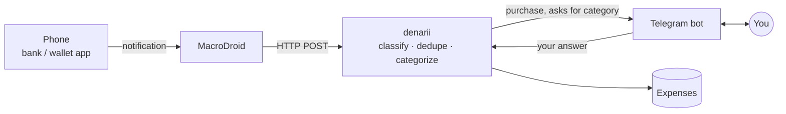

# expense_server

Codename **denarii**. Turns phone payment notifications into categorized expenses, asking via Telegram when it can't decide. See [SPEC.md](SPEC.md).

## How it works

## Architecture

