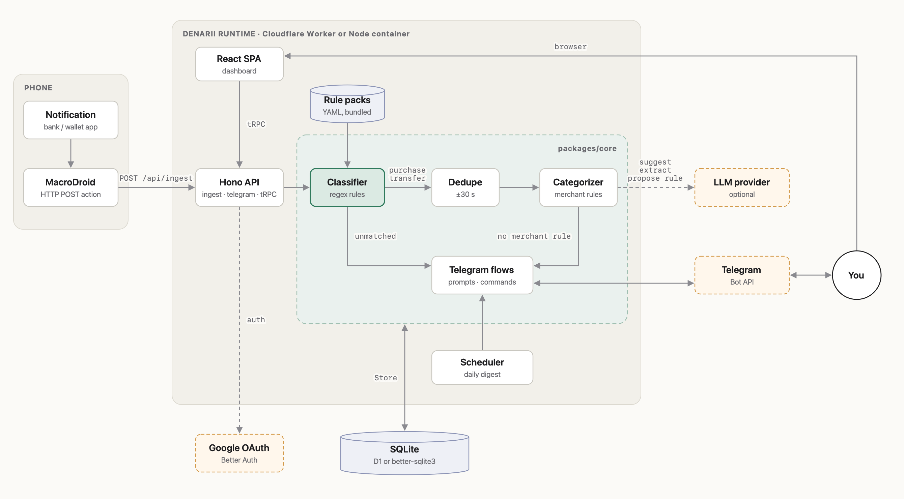

# expense_server

Codename **denarii**. Turns phone payment notifications into categorized expenses, asking via Telegram when it can't decide. See [SPEC.md](SPEC.md).

## Architecture

<picture>
  <source media="(prefers-color-scheme: dark)" srcset="docs/diagrams/architecture-dark.png">
  
</picture>
